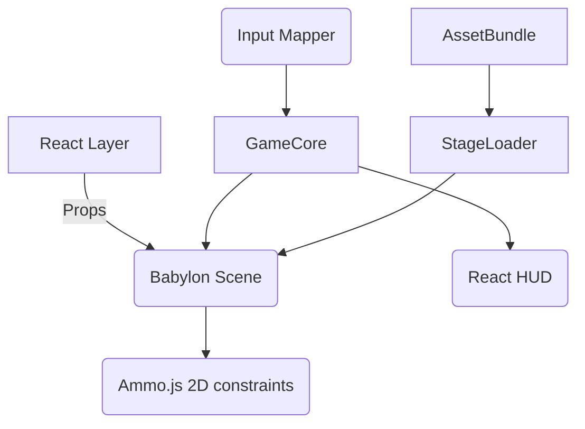

# **“Lunchtime Smash” – Product Requirements Document (v1.1)**  
*Updated 2025‑07‑09*

> **Elevator Pitch**  
> Build a lightning‑fast, four‑player **platform‑fighter** for Amazon Fire TV Stick 4K Max.  
> Developed in **TypeScript + Babylon.js 5.x + React**, the game delivers Smash‑style depth—dash‑dancing, fast‑falls, parries—within 30‑minute lunch breaks.  
> **Low‑poly 3‑D models** fight on a 2‑D plane across five minimalist stages at **60 FPS target** (30 FPS floor).  
> Couch‑co‑op only: Bluetooth HID pads, keyboard (web dev), and Fire TV remote (solo test).

---

## 1  Problem Statement

Office gamers need a quick, competitive brawler on Fire TV; existing titles (Jackbox, Minecraft) lack responsive, skill‑based combat. “Lunchtime Smash” fills that gap by bringing **Smash‑like mechanics** to a ubiquitous streaming device with controllers already on hand.

*Basic User Story*  
> *“As a coworker on lunch break, I want to fire up the office TV, pick a quirky fighter, and settle bragging rights in a tight 3‑stock battle—all before my break ends.”*

---

## 2  Project Scope

| **In‑Scope (MVP)** | **Out‑of‑Scope** |
|--------------------|------------------|
| Local 1‑4 player matches (three stocks) | Online multiplayer or rollback netcode |
| **8 fighters** w/ unique attacks & frame‑data | Alternate costumes / skins |
| **5 stages** (no hazards/items) | Complex moving stages, scrolling arenas |
| Mechanics: dash/run, fast‑fall, **air‑dodge**, grab, parry + hold‑shield | Wall‑jump, ledge‑hang, wavedash |
| Dynamic camera zoom, KO blast‑zones | Replays, spectator mode |
| Menus: Title → Character → Stage → Match → Results → Loop | Tournament/bracket mode |
| Placeholder low‑poly art, CC‑licensed SFX, **ambient BGM loops** | Final polished art/audio |
| Packaging as Amazon HTML5 Web App & browser build | Native APK, monetization, ads |
| English localization | Multi‑lingual 

---

## 3  Personas

| Persona | Needs & Pain Points |
|---------|--------------------|
| **Competitive Carl** (29, dev) | 60 FPS, tight inputs, advanced tech (parry). |
| **Casual Lena** (34, PM) | Easy setup, readable UI, remote fallback. |
| **QA Quentin** (23, intern) | Keyboard control, deterministic builds. |

---

## 4  Core Gameplay Requirements

### 4.1  Fighters

| # | Name | Archetype | Weight | Speed | Unique Notes |
|---|------|-----------|--------|-------|--------------|
| F1 | **Alex Trebek** | Balanced quizmaster | Medium | Med | “Answer?” taunt; knowledge‑beam special |
| F2 | **Cow** | Heavy tank | High | Low | Chargeable head‑butt; mooo parry SFX |
| F3 | **Dr Shen** | Technical swordsman | Med‑High | Med | Long reach katana tilts; parry window +2 f |
| F4 | **Next Coming of Christ** | Floaty mage | Low | High (air) | Double mid‑air jump; halo projectile |
| F5 | **Helicopter** | Heavy zoner | High | Med (hover) | Rotor multi‑hit, rising recovery |
| F6 | **Angry Turkey** | Speedy glass‑cannon | Low | High | Dash‑dance accel bonus; fast‑fall ×1.3 |
| F7 | **Two Babies w/ Two Knives** | Dual‑stance trickster | Med | High | Swap stance for grab vs slash |
| F8 | **Two‑Beer Muizz** | Drunken brawler | Med‑High | Med | Random stumble armour frames |

*Each fighter receives:*  
- **10 core animations** (idle, walk, run, jump, aerial, light, special, smash, grab, shield).  
- Frame‑data spreadsheet (startup, active, end‑lag in frames @60 FPS).  
- 1 parry window (3 frames invuln).

### 4.2  Movement & Combat

| Mechanic | Specification |
|----------|---------------|
| **Dash/Run** | Double‑tap or hold stick >0.8; 10‑frame accel, 5‑frame skid cancel. |
| **Fast‑Fall** | Hold ↓ while airborne; vertical speed +50 %. |
| **Air‑Dodge** | Shield button in air; 15 invuln frames, 20 recovery. |
| **Shield** | Hold LB/RB; radius shrinks at 1 %/frame; break = 100 frames stun. |
| **Parry** | First 3 frames of shield; attacker recoil 8 frames, defender invuln 5. |
| **Grabs / Throws** | Y button; 7‑frame startup, 4 active; pummel + directional launch. |
| **Damage %** | Knockback = base + (damage × multiplier) per move. |
| **KO** | Crossing invisible blast‑zones; explosion FX, lose stock. |

### 4.3  Stages

| ID | Layout | Platforms | Blast‑Zone (WU) | Visual Theme |
|----|--------|-----------|-----------------|--------------|
| S1 | Flat | 0 | ± 900 h / 600 v | Office Rooftop sunset |
| S2 | Classic tri‑plat | 3 (∧) | ± 950 / 650 | Game‑Show Set lights |
| S3 | Dual side‑plat | 2 (L‑shaped) | ± 875 / 600 | Cow Pasture dusk |
| S4 | Tall center | 1 (pillar) | ± 850 / 580 | Neon Night skyline |
| S5 | Moving side | 2 (± 50 WU linear) | ± 900 / 620 | Bird Clouds day |

*WU = World Units (1 WU = 1 meter grid).*

### 4.4  Input Mapping

```text
Gamepad  : A‑Light  B‑Special  X‑Jump  Y‑Grab  LB/RB‑Shield  LT‑Parry+Direction  Start‑Pause
Keyboard : X‑Light  C‑Special  Z‑Jump  A‑Grab  S‑Shield      D‑Parry    Enter‑Pause
Remote   : OK‑Light Play‑Jump  Menu‑Pause (single‑player test)
```

---

## 5  Non‑Functional Requirements

| Category | Target |
|----------|--------|
| **Performance** | 60 FPS target, 30 FPS minimum on Stick 4K Max (IMG GE8300 GPU). |
| **Latency** | ≤40 ms input‑to‑action. |
| **Memory** | Peak RAM ≤1.5 GB. |
| **Binary Size** | ≤150 MB zipped bundle. |
| **Accessibility** | Color‑blind safe palettes; subtitles toggle. |
| **Code Style** | ESLint – *no semicolons*; Prettier enforced. |
| **Security** | No outbound network deps; local storage only. |

---

## 6  Technical Architecture

### 6.1  High‑Level Diagram



### 6.2  Repo Layout

```
/packages
  /game-core      ← State machine, stocks, damage calc
  /fighters       ← Character JSON + animations
  /stages         ← GLB + scene defs
  /systems        ← Input, Camera, Physics
  /ui             ← React components + HUD
/apps
  /web            ← Vite dev build
  /firetv         ← Amazon Web App wrapper
```

*Branch strategy:*  
- `main` = protected.  
- `feat/<scope>` branches per package.  
- PR template requires unit tests + type‑check pass.  
- Large asset drops via Git LFS to avoid merge conflicts.

---

## 7  Milestones & Acceptance Tests

| # | Milestone | Team Split | Duration | Exit Criteria |
|---|-----------|-----------|----------|---------------|
| **M0** | Bootstrap | Core | 1 wk | Blank Babylon scene renders 60 FPS in browser & Stick. |
| **M1** | Input & Camera | Core + Engine | 2 wks | 4 pads move cubes; camera keeps all visible; CI headless test mocks Gamepad API. |
| **M2** | Physics + KO | Engine | 3 wks | Damage %, knockback, blast‑zones; Jest sim tests pass. |
| **M3** | Fighter Pipeline | Tools | 2 wks | Import GLB + JSON to spawn character prefab; hot‑reload. |
| **M4** | Full Move‑Sets | Characters | 3 wks | All 8 fighters implement spreadsheet frame‑data; unit hitbox tests. |
| **M5** | Stages & Camera Polish | World | 2 wks | 5 stages load & swap; moving platforms sync @60Hz. |
| **M6** | Menus & HUD | UI | 1 wk | Navigable flow; pause, results; Cypress e2e. |
| **M7** | Perf Pass | All | 1 wk | Profiling meets perf budgets; texture atlases 4k. |
| **M8** | Internal Beta | QA | 1 wk | 90 min stress test, <1 crash; feedback logged. |
| **M9** | Release Candidate | PM | 1 wk | Passes Amazon Web App checklist. |

---

## 8  Detailed User Stories & Acceptance Criteria

### 8.1  Menu Flow

| US‑ID | Story | Criteria | Priority |
|-------|-------|----------|----------|
| **US‑MM‑01** | *As any user* I see a title screen with “Play” & “Settings”. | Loads <3 s, inputs accepted; background ambient loop. | P0 |
| **US‑MM‑02** | *As P1* I can add up to 3 controllers. | Controller icons light when connected; hot‑plug detect. | P0 |
| **US‑CS‑01** | *As a player* I choose my fighter via carousel. | Portrait, weight/speed stats, cooldown voice line. | P0 |
| **US‑SS‑01** | Stage select grid shows 5 tiles + random. | Hover anim; confirm button selects. | P0 |

### 8.2  Combat

| US‑Combat‑01 | **Input ≤1 frame latency** verified by automated replay reading Gamepad.timestamp diff. |
| US‑Combat‑02 | **Parry**: Shield within 3 frames → white flash, attacker stun 8 f. |
| US‑Combat‑03 | **Air‑Dodge**: Shield in air → intangible 15 f; no action 20 f landing lag. |
| US‑Combat‑04 | **Fast‑Fall** toggles if ↓ held for ≥2 f; vertical vel = -30 WU/s. |
| US‑Combat‑05 | **KO Sequence** triggers slow‑mo 0.5× for 30 f, screen shake ±10 px. |

*(Full table continues in `combat_user_stories.md`)*

---

## 9  Testing Strategy

- **Unit Tests**: Damage calc, knockback formulae (Jest + ts‑jest).  
- **Integration**: Headless Babylon render harness (Puppeteer).  
- **Performance**: Automated FPS capture via `dat.gui` stats; CI fails <55 FPS.  
- **E2E**: Cypress runs menu flows in browser, uses Gamepad API stubs.  
- **Manual**: Stick playtests with frame‑timer overlay.

---

## 10  Metrics & Telemetry (Local Only)

- FPS histogram (# frames between 50‑60).  
- Input latency (frame delta between event & animation).  
- Crash logs (try/catch global handler → localStorage‑persist).  
*No external network; telemetry dumped to JSON for manual share.*

---

## 11  Risk Register

| Risk | Likelihood | Impact | Mitigation |
|------|------------|--------|------------|
| 60 FPS not sustainable on Stick 4K Max | Medium | High | Aggressive LOD, vertex‑color only, disable post‑FX. |
| Merge conflicts on fighter frame‑data | High | Med | Store per‑fighter JSON; no shared CSV. |
| Controller mapping variance | High | Med | Config `mappings/*.json` per vendor; fallback prompt. |
| Babylon/React type defs drift | Low | Med | `pnpm` + exact version ranges; renovate PR bot. |

---

## 12  Future Enhancements

- Items/hazards, wall‑jump mechanics.  
- Custom button remapping UI.  
- Online rollback via WebRTC + GGPO‑style prediction.  
- Full art pass with unique rigs and crowd VFX.

---

## 13  Appendix

### 13.1  Asset Guidelines

- **Poly Budget**: ≤5 k tris per fighter, ≤20 k per stage.  
- **Texture**: Single 1 k atlas per fighter; vertex colors preferred.  
- **Audio**: OGG Vorbis, 44.1 kHz; loops ≤1 MB.

### 13.2  Coding Conventions

- `export const` modules; no default exports.  
- **No semicolons**; StandardJS spacing.  
- React hooks naming: `useThingX`.  
- Public enums UPPER_SNAKE_CASE.

---

*Prepared by “Little Piggy” – 2025‑07‑09.  
Please review and sign off to begin sprint planning.*
